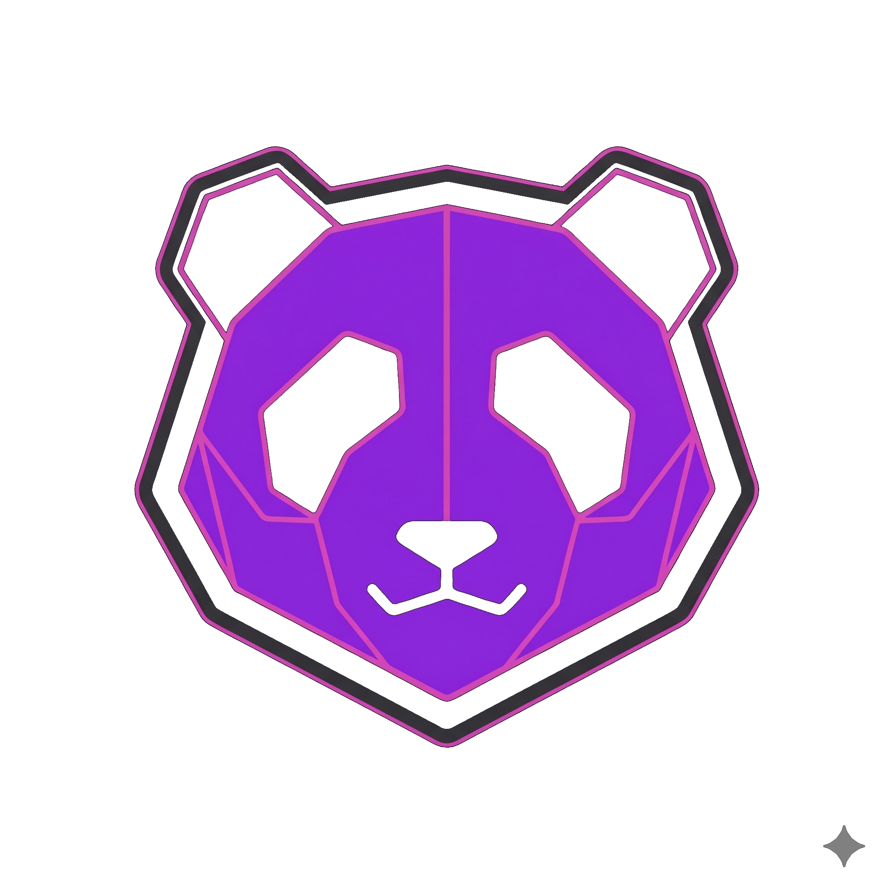

<p align="center">
  
</p>

# 🐼 Panda End — Retro Emulator Frontend

Panda End is a modern, elegant, and high-performance frontend for retro console emulation, designed to run natively on both **Desktop** and **Mobile (Android)** devices. Powered by **NativePHP** combined with **Laravel**, **Vite**, **React (TypeScript)**, and **EmulatorJS**, it offers offline-first retro gameplay and multiplayer synchronization.

---

## ✨ Features

### 🎮 Multi-System Console Support
Play classics from dozens of nostalgic platforms:
* **Nintendo:** NES, SNES, N64, Game Boy (GB), Game Boy Advance (GBA), Nintendo DS (NDS), Virtual Boy.
* **Sega:** Master System, Mega Drive, Game Gear, Sega CD, Sega 32X, Saturn.
* **Sony:** PlayStation (PSX), PSP.
* **Others:** Atari (2600, 5200, 7800, Jaguar, Lynx), Commodore (C64, C128, Amiga, PET, Plus4, VIC-20), MAME 2003, Arcade, MSX, Neo Geo Pocket, TurboGrafx-16 (PC Engine), WonderSwan, and more.

### 🖥️ Desktop & Mobile (Cross-Platform)
* **Desktop:** Compiled as a lightweight desktop app via **Electron** (with a local PHP environment running out of the box).
* **Mobile (Android):** Runs using the **NativePHP Android Bridge** with a custom **Kotlin** integration, establishing a high-performance communication link and WebView.

### ⚡ Smart Offline-First Emulation
* **EmulatorJS CDN Proxy:** On first launch, the app downloads WebAssembly cores and emulator assets from a stable CDN and caches them locally under `public/emulatorjs/`. This enables **100% offline gameplay** on subsequent launches.
* **Local Saves:** Saves and loads your emulation states (`.sav`) directly to/from your device's filesystem.

### 🌐 Netplay Multiplayer (P2P)
* Connect with friends for online co-op or versus play. The Host runs the ROM locally on their NativePHP instance and syncs Player 2's inputs with ultra-low latency, requiring no router configuration or port forwarding.

---

## 🛠️ Tech Stack

* **Core/Backend:** PHP 8.2+ & [Laravel 11](https://laravel.com)
* **Frontend:** [Vite](https://vite.dev) + [React](https://react.dev) + [TypeScript](https://www.typescriptlang.org) + [TailwindCSS](https://tailwindcss.com) + [Lucide Icons](https://lucide.dev)
* **Desktop Framework:** [NativePHP Electron](https://nativephp.com)
* **Mobile Framework:** [NativePHP Mobile](https://github.com/nativephp/laravel) (Android Module with native Kotlin code)
* **Emulation Engine:** [EmulatorJS](https://emulatorjs.org) (WebAssembly / WASM)

---

## 📦 Installation and Local Setup

### Prerequisites
Make sure your development environment has:
* PHP 8.2 or higher (with SQLite and ZIP extensions enabled)
* Composer
* Node.js & npm
* Android SDK & Android Studio (only for Mobile builds)

---

### Step-by-Step Setup

1. **Clone the repository:**
   ```bash
   git clone git@github.com:satodu/panda-end-front.git
   cd panda-end-front
   ```

2. **Install Laravel dependencies:**
   ```bash
   composer install
   ```

3. **Install Frontend dependencies:**
   ```bash
   npm install
   ```

4. **Configure environment variables:**
   ```bash
   cp .env.example .env
   php artisan key:generate
   ```

5. **Create and migrate the SQLite database:**
   ```bash
   touch database/database.sqlite
   php artisan migrate
   ```

---

### Running in Development Mode

#### 1. Web/Desktop Version (Vite + Laravel)
Run the local servers:
```bash
# Laravel backend server
php artisan serve

# Real-time frontend compilation (Vite)
npm run dev
```

To launch the desktop application via NativePHP Electron:
```bash
php artisan native:serve
```

#### 2. Mobile Version (Android)
Navigate to the `mobile/` directory and configure the necessary symlinks before building:
```bash
# Setup symlinks for views/assets
shscripts/setup-mobile-symlinks.sh
```

Run the build automation script:
```bash
# Execute the build helper script
shscripts/build-android.sh
```
The script will guide you through:
1. **Generating and signing a Sideload APK:** Compiles the final release app and puts it in `mobile/nativephp/android/app/build/outputs/apk/PandaEnd.apk` for easy transfer to your phone.
2. **Direct install over USB:** Automatically installs and launches the app on a connected Android device with USB Debugging enabled.
3. **Open in Android Studio:** Opens the Kotlin native project (`mobile/nativephp/android`) for advanced debugging and development.

---

## 📁 Directory Structure

```text
├── app/Http/Controllers/     # Laravel controllers (Import, SaveStates, CDN Proxy)
├── config/native.php         # NativePHP Desktop configuration
├── database/                 # SQLite database structure
├── mobile/                   # Mobile submodule and configurations
│   ├── nativephp/android/    # Kotlin native integration bridge (WebView/Wrapper)
│   └── vite.config.ts        # Vite configuration for Mobile
├── public/                   # Public directory & cached EmulatorJS assets
├── resources/js/             # React SPA (Vite + TailwindCSS)
│   ├── components/game/      # Emulator container and game library grid
│   ├── views/                # Views (Library, ROM Importer, Netplay, Login)
│   └── main.tsx              # React entrypoint
├── shscripts/                # Android build scripts
└── vite.config.ts            # Main Vite configuration for Desktop/Web
```

---

## 🛡️ Security and Best Practices (Open Source)

The **Panda End Frontend** is ready for open-source contribution! The `.gitignore` files are optimized to protect your development credentials and prevent massive files from bloating the repository:
* **Local database and logs:** Never committed.
* **Secrets:** Local `.env` files are completely hidden.
* **Large files:** Blocks desktop installer executables (`.exe`/`.dmg`) and compiled Android bundles (`laravel_bundle.zip` of ~76MB).
* **Production configs:** Proactively ignores `google-services.json` (Firebase) to keep your project credentials secure.

---

## 🤝 Special Thanks

This project is built on top of amazing open-source technologies. Special thanks to:
* **[EmulatorJS](https://emulatorjs.org/)** — For the robust WebAssembly emulation engine that makes offline play possible.
* **[Laravel](https://laravel.com/)** — For the elegant and highly productive backend framework.
* **[Electron](https://www.electronjs.org/)** — For the desktop shell technology that powers the desktop app.
* **[NativePHP](https://nativephp.com/)** — For the bridge bringing PHP to Desktop and Mobile environments.

---

## 📄 License

This project is open-source software licensed under the [MIT license](LICENSE).
